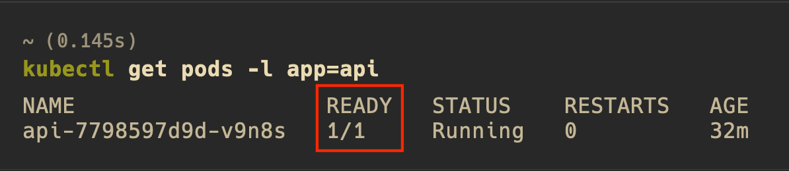
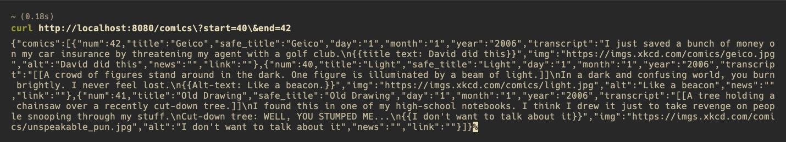
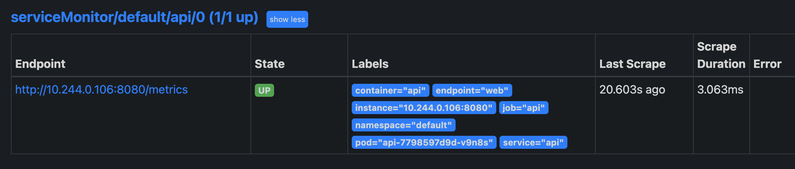
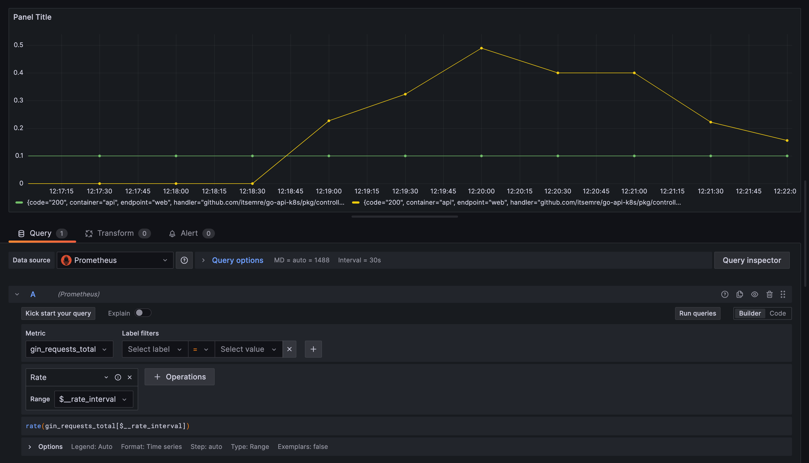

# go-api-k8s

This is an example setup showcasing the deployment of a simple API on a Kubernetes cluster, along with [kube-prometheus-stack](https://github.com/prometheus-community/helm-charts/tree/main/charts/kube-prometheus-stack) for monitoring, using Helm Charts.

## Table of Contents
1. [Introduction](#introduction)
2. [Requirements](#requirements)
3. [Installation](#installation)
4. [Configuration](#configuration)
5. [Next Steps](#next-steps)
6. [License](#license)

## Introduction <a name="introduction"></a>

The API that is showcased here, given a range of comics, retrieves the ones that were published on odd months, in an alpabetically sorted order by title, from [xkcd](https://xkcd.com/). This can be achieved using a simple request such as `/comics?start=40&end=42`. It comes with lot of functionality out of the box, that allows it to be used as a template to build much more complex APIs.

The API also includes a number of unit tests that will be automatically ran by a GHA workflow, triggered automatically when a pull request or a push was made on the master branch.

Moving further, this API is Dockerized and deployed into a local minikube cluster using Helm, along with Prometheus and Grafana via the [kube-prometheus-stack](https://github.com/prometheus-community/helm-charts/tree/main/charts/kube-prometheus-stack). The prometheus can not only collect the kubernetes metrics, but also the metrics that are exposed by the `/metrics` endpoint of the API.

## Requirements <a name="requirements"></a>

You will need the following dependencies installed:

1. [Docker](https://docs.docker.com/engine/install/)

   ```bash
   brew install docker
   ```

2. [Minikube](https://minikube.sigs.k8s.io/docs/start/)

   ```bash
   brew install minikube
   ```

3. [Kubectl](https://kubernetes.io/docs/tasks/tools/)

   ```bash
   brew install kubectl
   ```

4. [Helm](https://helm.sh/docs/intro/install/)

   ```bash
   brew install helm
   ```

## Installation <a name="installation"></a>

To install and run the project, follow these steps:

**1. Deploy the Project**

- Clone the project repository from GitHub:

    ```bash
    git clone https://github.com/itsemre/go-api-k8s
    ```

- Ensure that the Docker daemon is running, and run the following make command:

    ```bash
    make deploy
    ```

This will create a minikube cluster and deploy the kube-prometheus-stack along with the API.

**2. Test the API**

- Ensure that the API pod is ready, meaning that it responds to Kubernetes health checks. Run:

    ```bash
    kubectl get pods -l app=api
    ```

    and make sure that the pod is in a "READY" state.

    

- Port-forward the API service:

    ```bash
    kubectl port-forward service/api 8080:8080
    ```

- Make an API request:

    ```bash
    curl http://localhost:8080/comics\?start=40\&end=42
    ```

    

**3. Check Prometheus**

- Port-forward the Prometheus service:

    ```bash
    kubectl port-forward service/kps-kube-prometheus-stack-prometheus 9090:9090
    ```

- Open `http://localhost:9090/` on your browser. Click "Status" > "Service Discovery" and check if the service monitor named `serviceMonitor/default/api/0` is being discovered.

- Click "Status" > "Targets" and make sure that the state of `serviceMonitor/default/api/0` is "UP", and that the rest of the metrics are being scraped.
        
    

**4. Check Grafana**

- Port-forward the Grafana service:

    ```bash
    kubectl port-forward service/kps-grafana 3000:80
    ```

- Open `http://localhost:3000/` on your browser. Log in to Grafana using the default username "admin" and password "prom-operator". Go to "Menu" > "Dashboards" and make sure that they have data.

- Inside any dashboard, click "Add" > "Visualization". Choose "Prometheus" as the "Data source". On the "Select metric" drop-down menu, search for metrics with the `gin_*` prefix. Select a metric such as `gin_requests_total` and click "Run queries". In the graph seen below, the green line represents the `/ping` requests made by Kubernetes, and the yellow line represents the requests that are made by us.

    

## Configuration <a name="configuration"></a>

The backend API supports configuration parameters that can be set using command-line flags, environment variables, or a configuration file in "env" format located in the `~/.api` directory. It is noteworthy that the API includes a flexible configuration method. All of the configuration parameters are defined in a go-struct named "Config" located in `/pkg/config/config.go`. This struct acts as a placeholder, holding a detailed definition of every configuration parameter such as the name, default value, environment variable key, etc. Based on these parameter definitions, the backend will automatically define command-line flags, along with their long & short forms and help messages. As well as bind them to their corresponding environment variable keys. This means that a single parameter can be set as an env var, CMD flag, or inside a config file. This also allows us to add a large amount of configuration parameters by simply inserting them in the struct, and letting the API handle the rest during startup.

The following table outlines the available configuration parameters that are included out of the box:

| Parameter | Flag | Default | Description | 
|:----------|:-----|:--------|:------------|
| `LOG_LEVEL` | `--log-level` | `info` | Logging level. Can only be one of `panic`, `fatal`, `error`, `warn`, `info`, `debug`, `trace`. |
| `SERVER_ADDRESS` | `--server-address` | `0.0.0.0` | The address that the web server will be listening to. |
| `SERVER_PORT` | `--server-port` | `8080` | The port that the web server will be listening to. |
| `SHUTDOWN_TIMEOUT` | `--shutdown-timeout` | `10` | The timeout (in seconds) for the server to shut down. |
| `CORS_ALLOW_ORIGINS` | `--cors-allow-origins` | `*` | Allow origins for CORS configuration. |
| `CORS_ALLOW_METHODS` | `--cors-allow-methods` | `GET POST PUT DELETE` | List of CORS methods that are allowed. |
| `CORS_ALLOW_HEADERS` | `--cors-allow-headers` | `Origin content-type` | List of CORS headers that are allowed. |
| `CORS_EXPOSE_HEADERS` | `--cors-expose-headers` | `Content-Length` | List of CORS headers that are exposed. |
| `CORS_ALLOW_CREDENTIALS` | `--cors-allow-credentials` | `false` | Whether to allow credentials to CORS. |
| `CORS_MAX_AGE` | `--cors-max-age` | `1` | Maximum age (in hours) pertaining to CORS configuration. |

To set these configuration parameters, you can choose one of the following methods:

**1. Command-line Flags** 
You can provide the configuration parameters as command-line flags when starting the service. For example:

```bash
./api serve --server-port=8080 --log-level=info
```

Run the following for more details:

```bash
./api --help     
Usage:
  api [flags]
  api [command]

Available Commands:
  completion  Generate the autocompletion script for the specified shell
  help        Help about any command
  serve       Begins the API

Flags:
      --cors-allow-credentials        Whether to allow credentials to CORS
      --cors-allow-headers strings    List of CORS headers that are allowed (default [Origin,content-type])
      --cors-allow-methods strings    List of CORS methods that are allowed (default [GET,POST,PUT,DELETE])
      --cors-allow-origins strings    Allow origins for CORS configuration (default [*])
      --cors-expose-headers strings   List of CORS headers that are exposed (default [Content-Length])
      --cors-max-age int              Maximum age (in hours) pertaining to CORS configuration (default 1)
  -h, --help                          help for api
      --log-level string              Logging level, can only be one of 'panic', 'fatal', 'error', 'warn', 'info', 'debug', 'trace'. (default "info")
      --server-address string         The address that the web server will be listening to (default "0.0.0.0")
      --server-port string            The port that the web server will be listening to (default "8080")
      --shutdown-timeout int          The timeout (in seconds) for the server to shut down (default 10)

Use "api [command] --help" for more information about a command.
```

**2. Environment Variables** 
Alternatively, you can set the configuration parameters as environment variables. The environment variable names should be prefixed with "API". For example:

```bash
export API_SERVER_PORT=8080
export API_LOG_LEVEL=info
```

**3. Configuration File** 
You can also specify the configuration parameters in a configuration file named `api` located in the `~/.api` directory. The file should follow the "env" format. Example content:

```bash
SERVER_PORT=8080
LOG_LEVEL=info
```

When the service starts, it will automatically look for this configuration file and load the parameters from it.


> **Note:** Command-line flags take precedence over environment variables, and both take precedence over the configuration file. If a parameter is specified in multiple ways, the value from the higher priority method will be used.

Feel free to adjust the configuration parameters based on your specific requirements.

## Next Steps <a name="next-steps"></a>

Check out `PRODUCTION.md` in order to get an overview of how this project can be improved and made production-ready.

## License <a name="license"></a>

The project is licensed under the [MIT License](LICENSE).